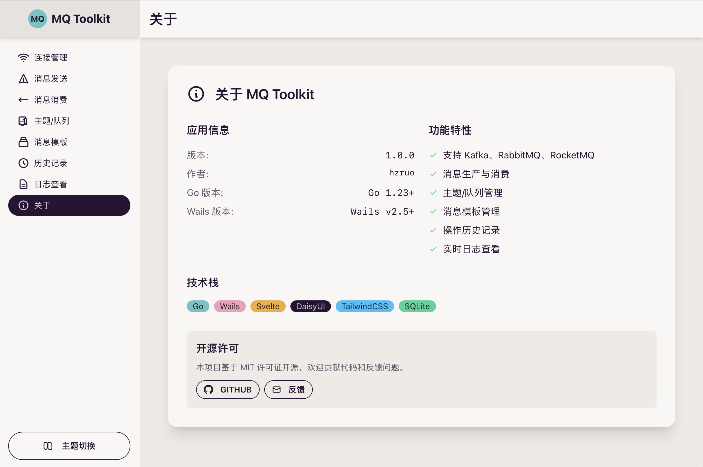

# MQ Toolkit

<div align="center">


**一个现代化的跨平台消息队列管理工具**

[](https://golang.org/)
[](https://wails.io/)
[](https://svelte.dev/)
[](LICENSE)

基于 **Wails 2.5** 和 **Go** 构建的跨平台消息队列测试工具
支持 **Kafka**、**RabbitMQ** 和 **RocketMQ**

[功能特性](#功能特性) • [快速开始](#快速开始) • [使用说明](#使用说明) • [贡献指南](#贡献指南)



</div>

---

## ✨ 功能特性

### 🚀 **多消息队列支持**
- **Kafka** - 完整支持，包括生产者、消费者、主题管理
- **RabbitMQ** - 支持队列操作、消息路由
- **RocketMQ** - 基础消息收发功能

### 🔧 **连接管理**
- 多连接配置管理
- 连接状态实时监控
- 连接测试和验证
- 安全的连接信息存储

### 📤 **消息生产**
- 支持单条和批量消息发送
- 自定义消息头和属性
- 消息模板管理
- 发送历史记录

### 📥 **消息消费**
- 实时消息监听
- 多主题订阅（RabbitMQ/RocketMQ）
- 单主题订阅（Kafka）
- 消费组管理
- 偏移量控制

### 📊 **数据管理**
- 主题/队列创建和删除
- 完整的操作历史追踪
- 详细的系统日志
- 数据导出功能

### 🎨 **现代化界面**
- 响应式设计，支持多种主题
- 直观的操作界面
- 实时状态更新
- 跨平台一致体验

## 🚀 快速开始

### 📋 环境要求

| 工具 | 版本要求 | 说明 |
|------|----------|------|
| **Go** | 1.23+ | 后端开发语言 |
| **Node.js** | 18+ | 前端构建工具 |
| **Wails CLI** | v2.5+ | 跨平台应用框架 |

### 📦 安装

#### 1. 克隆项目
```bash
git clone https://github.com/hzruo/mqtoolkit.git
cd mqtoolkit
```

#### 2. 安装依赖
```bash
# 安装 Go 依赖
go mod tidy

# 安装前端依赖
cd frontend && npm install && cd ..
```

#### 3. 安装 Wails CLI（如果未安装）
```bash
go install github.com/wailsapp/wails/v2/cmd/wails@latest
```

### 🛠️ 开发模式

```bash
# 启动开发服务器（推荐）
wails dev

# 或者分别启动前后端
# 后端
go run . -tags dev

# 前端（新终端）
cd frontend && npm run dev
```

### 📦 构建应用

```bash
# 构建生产版本
wails build

# 构建到指定目录
wails build -o ./dist/
```

## 🛠️ 技术栈

<table>
<tr>
<td width="50%">

### 后端技术
- **Go 1.23** - 高性能后端语言
- **Wails 2.5** - 跨平台应用框架
- **GORM** - Go ORM 库
- **SQLite** - 轻量级数据库
- **Kafka Go** - segmentio/kafka-go
- **RabbitMQ Go** - rabbitmq/amqp091-go

</td>
<td width="50%">

### 前端技术
- **Svelte 4** - 现代前端框架
- **DaisyUI** - 组件库
- **Tailwind CSS** - 样式框架
- **Vite** - 构建工具
- **TypeScript** - 类型安全

</td>
</tr>
</table>

## 📁 项目结构

```
MQToolkit/
├── 📁 app.go                    # Wails 应用入口
├── 📁 main.go                   # 程序主入口
├── 📁 internal/                 # 内部包
│   ├── 📁 database/             # 数据库层
│   ├── 📁 factory/              # 工厂模式
│   ├── 📁 logger/               # 日志系统
│   ├── 📁 mq/                   # 消息队列抽象层
│   │   ├── 📁 kafka/            # Kafka 实现
│   │   ├── 📁 rabbitmq/         # RabbitMQ 实现
│   │   └── 📁 rocketmq/         # RocketMQ 实现
│   └── 📁 service/              # 业务服务层
├── 📁 pkg/                      # 公共包
│   ├── 📁 types/                # 类型定义
│   └── 📁 utils/                # 工具函数
├── 📁 frontend/                 # 前端代码
│   ├── 📁 src/                  # 源代码
│   │   ├── 📁 components/       # Svelte 组件
│   │   ├── 📁 store.js          # 状态管理
│   │   └── 📁 App.svelte        # 主应用组件
│   └── 📁 wailsjs/              # Wails 生成的 JS 绑定
├── 📁 build/                    # 构建输出
└── 📁 data/                     # 数据文件
```

## 📖 使用说明

### 🔗 连接管理
1. 点击 **"连接管理"** 标签页
2. 点击 **"添加连接"** 按钮
3. 填写连接信息（主机、端口、认证等）
4. 点击 **"测试连接"** 验证配置
5. 保存连接配置

### 📤 发送消息
1. 选择一个已配置的连接
2. 进入 **"消息发送"** 标签页
3. 输入主题名称和消息内容
4. 可选：设置消息头和分区
5. 点击 **"发送消息"** 按钮

### 📥 消费消息
1. 选择一个已配置的连接
2. 进入 **"消息消费"** 标签页
3. 选择要消费的主题
4. 配置消费组和偏移量设置
5. 点击 **"开始消费"** 按钮
6. 实时查看接收到的消息

### 🗂️ 主题管理
1. 进入 **"主题/队列"** 标签页
2. 查看现有主题列表
3. 创建新主题或删除现有主题
4. 查看主题详细信息

### 📊 历史记录
- 所有操作都会自动记录
- 可按类型筛选（发送、消费、测试）
- 支持搜索和导出功能

### 📝 日志查看
- 实时查看系统日志
- 按级别筛选日志
- 支持日志导出

## 🤝 贡献指南

我们欢迎所有形式的贡献！

### 如何贡献
1. **Fork** 本仓库
2. 创建您的特性分支 (`git checkout -b feature/AmazingFeature`)
3. 提交您的更改 (`git commit -m 'Add some AmazingFeature'`)
4. 推送到分支 (`git push origin feature/AmazingFeature`)
5. 打开一个 **Pull Request**

### 报告问题
- 使用 [GitHub Issues](https://github.com/hzruo/mqtoolkit/issues) 报告 bug
- 提供详细的复现步骤和环境信息
- 包含相关的日志和截图


## 📄 许可证

本项目基于 [MIT License](LICENSE) 开源。

## 🙏 致谢

感谢以下开源项目：
- [Wails](https://wails.io/) - 跨平台应用框架
- [Svelte](https://svelte.dev/) - 前端框架
- [DaisyUI](https://daisyui.com/) - UI 组件库
- [segmentio/kafka-go](https://github.com/segmentio/kafka-go) - Kafka Go 客户端
- [rabbitmq/amqp091-go](https://github.com/rabbitmq/amqp091-go) - RabbitMQ Go 客户端

---

<div align="center">

**如果这个项目对您有帮助，请给它一个 ⭐️**

Made with ❤️ by [hzruo](https://github.com/hzruo)

</div>
